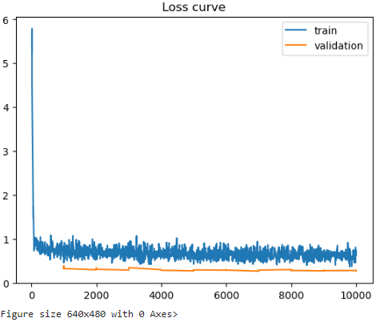
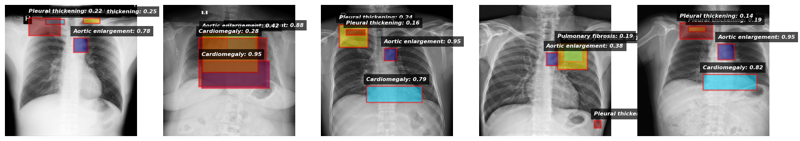
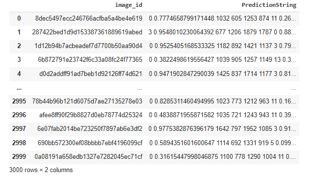

<h1 align="center">🩺 Chest Disease Detection using Deep Learning (R-CNN)</h1>  

<i>Accelerating Diagnosis with Artificial Intelligence</i>
  

---

<h2>✨ Description</h2>  

  
The <b>Chest Disease Detection using Deep Learning (R-CNN)</b> project utilizes advanced deep learning techniques to automate the detection and classification of chest diseases from X-ray images. By leveraging the Faster R-CNN architecture and transfer learning, the system supports radiologists in diagnosing conditions like pneumonia, tuberculosis, and lung cancer. The project is built using the NIH ChestX-ray14 dataset, which provides annotated data for robust training and evaluation.  

  

---

<h2>🎯 Objectives</h2>  

  
- Design a Faster R-CNN-based model for thoracic pathology detection.   
- Utilize evaluation metrics such as Average Precision (AP), sensitivity, and specificity.   
- Apply data augmentation and transfer learning to improve accuracy.   
- Provide interpretable outputs through bounding box predictions.   

  

---

<h2>🛠️ Technologies Used</h2>  

<h3>💻 Frameworks and Libraries</h3>  

  
- <b>PyTorch:</b> Implemented Faster R-CNN architecture with support for fine-tuning and transfer learning.   
- <b>Detectron2:</b> Used for advanced object detection tasks, including bounding box predictions.   
- <b>NumPy & Pandas:</b> Managed and preprocessed large-scale tabular and image datasets.   

  

<h3>📊 Data Visualization</h3>  

  
- <b>Matplotlib:</b> Plotted results such as loss curves, AP metrics, and data distributions.   
- <b>Seaborn:</b> Generated detailed bar charts and heatmaps to analyze dataset characteristics.   

  

<h3>📂 Dataset and Storage</h3>  

  
- <b>NIH ChestX-ray14:</b> Large-scale dataset with over 112,000 labeled X-ray images.   
- <b>Local and Cloud Storage:</b> Efficient storage and management of high-resolution X-ray images during training.   

  

<h3>⚙️ Model Development</h3>  

  
- <b>ResNet-50:</b> Used as the backbone for Faster R-CNN for feature extraction.   
- <b>Transfer Learning:</b> Fine-tuned pre-trained weights to adapt to chest disease detection.   

  

<h3>🔐 Tools and Utilities</h3>  

  
- <b>Google Colab:</b> Leveraged GPU acceleration for efficient model training.   
- <b>OpenCV:</b> Preprocessed X-ray images to standardize dimensions and formats.   

  

---

<h2>📂 Dataset</h2>  

  
The <b>NIH ChestX-ray14</b> dataset provides labeled X-ray images for 14 disease classes.  

<b>Key Features:</b>   
- <b>Size:</b> Over 112,000 PNG images.   
- <b>Annotations:</b> Diseases like Atelectasis, Cardiomegaly, and Pneumothorax.   
- <b>Challenges:</b> Class imbalance and limited bounding box annotations.   

  

---

<h2>📈 Results</h2>  

<h3>1️⃣ Loss Curve</h3>  

  

  
The loss curve demonstrates the model's training progress and convergence over epochs.

<h3>2️⃣ Bounding Box Predictions</h3>  

  

  
The Faster R-CNN model accurately localizes and classifies chest diseases, visualized using bounding box predictions.

<h3>3️⃣ Prediction Table</h3>  

  

  
Quantitative output of the model for selected images, showcasing bounding box coordinates and confidence scores.

---

<h2>🌟 Future Scope</h2>  

  
- <b>Real-Time Data:</b> Integrate APIs for real-time data streams for faster diagnostics.   
- <b>Explainable AI:</b> Enhance interpretability using saliency maps and heatmaps.   
- <b>Pixel-Level Segmentation:</b> Adopt Mask R-CNN to generate detailed region-based disease detections.   
- <b>Generalization:</b> Expand dataset with rare diseases and global datasets.   

  

---
